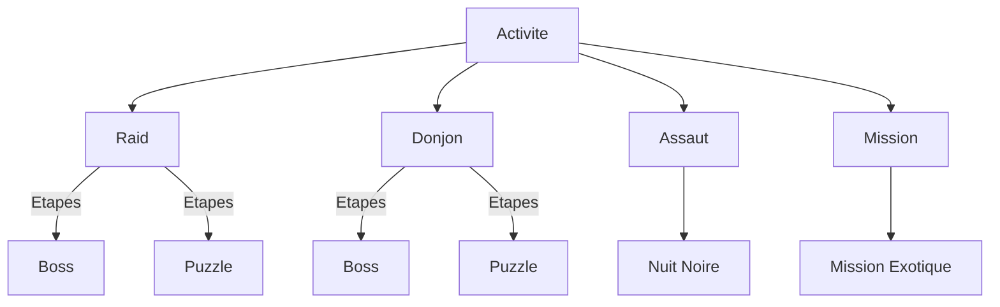

# Projet d'INFO907 - Ingénierie de la connaissance

## Description

Ce projet a été réalisé dans le cadre du projet final d'INFO907 à l'Université Savoie Mont Blanc.

C'est un simple projet html/css/js qui met en oeuvre une ontologie représentant les activités disponible de Destiny 2.
Il est possible d'utiliser une recherche pour trouver les activités possibles en fonctions de plusieurs critères.

### Ontologie

L'ontologie est représentée sous formes de classes js dans le fichier `ontologie.js`.
Les activités sont regroupées dans des catégories, qui sont elles-mêmes regroupées dans des types d'activités.

## Execution

Pour lancer le projet, il suffit de lancer un serveur web sur le dossier racine du projet, ou de simplement d'ouvrir le fichier `index.html` dans un navigateur.

Le site affiche simplement toutes les activités répondant aux filtres. Certaines activités peuvent être agrandis avec les détailes de leurs étapes si elles en ont.